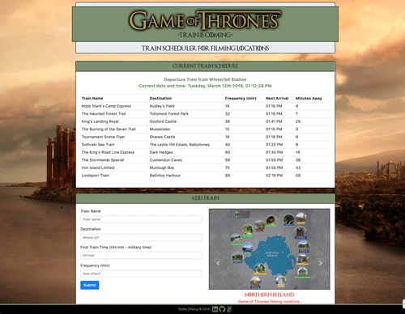
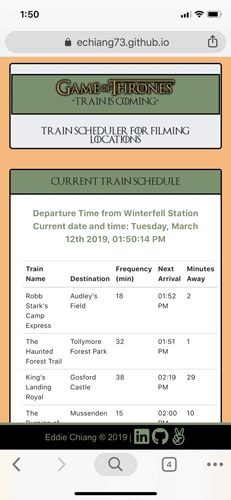

# Game of Thrones - Firebase
Game of Thrones Filming Location Train Scheduler

"Train is coming!" Hop aboard on the Game of Thrones trains to visit the GoT filming locations. This train schedule application incorporates Firebase to host arrival and departure data in "real-time". The app will retrieve and manipulate this information with Moment.js. The web application will provide up-to-date information about various trains, namely their arrival times and how many minutes remain until they arrive at their station.  You can play the role of a train administrator and add/edit/delete train information.  The information will automatically update each minute and is synced across multiple devices and/or browsers.

## App Interface
Instructions:
* Enter new train information and submit to display.
* Click on the carousel control to control the slides.

Click on the link!
https://echiang73.github.io/GoT_train/

## Built with
* HTML5
* CSS3
* JavaScript
* Bootstrap
* jQuery
* Firebase API for real-time, multi-device -browser synchronization
* Moment.js to manage and calculate time in JS.
* Responsive Web Design Media Query
* Font Awesome and @font-face for GoT font

### Here are the previews of the game:

